  

## 📌 About Me
- I build things because I genuinely can't stop thinking about them.
- For me, engineering isn't a career path — it's the closest thing I have to a superpower. I'm drawn to problems that sit at the edge of what's possible, especially where AI meets real human needs.
- I move fast, learn faster, and I'm never satisfied with "good enough." Whether it's diving into a new framework at midnight or rethinking an entire architecture because something felt off — that's just how I operate.
- My current obsession is intelligent systems — agents that reason, pipelines that scale, and interfaces that feel like magic to use.
- > Always learning. Always building. Always one project away from the next big idea.

## 🧠 My Focus Areas
- 🤖 LLM Applications & RAG Systems
- 🕸️ Full-Stack Web Development
- 🧠 Multi-Agent AI Systems
- ⚙️ Backend Engineering & APIs
- ☁️ Cloud Infrastructure & DevOps

## 📊 GitHub Stats & Trophies

  

## 🛠️ Languages & Tools

<h3 align="center">Programming Languages</h3>

  &nbsp;&nbsp;
  &nbsp;&nbsp;
  &nbsp;&nbsp;
  

<h3 align="center">Frontend</h3>

  &nbsp;&nbsp;
  &nbsp;&nbsp;
  &nbsp;&nbsp;
  &nbsp;&nbsp;
  

<h3 align="center">Backend</h3>

  &nbsp;&nbsp;
  

<h3 align="center">Database</h3>

  &nbsp;&nbsp;
  &nbsp;&nbsp;
  

<h3 align="center">DevOps & Cloud</h3>

  &nbsp;&nbsp;
  &nbsp;&nbsp;
  &nbsp;&nbsp;
  

<h3 align="center">Tools</h3>

  &nbsp;&nbsp;
  &nbsp;&nbsp;
  &nbsp;&nbsp;
  &nbsp;&nbsp;
  

  

## 🔗 Connect with Me

  &nbsp;&nbsp;&nbsp;&nbsp;&nbsp;&nbsp;
  &nbsp;&nbsp;&nbsp;&nbsp;&nbsp;&nbsp;
  

  

  

